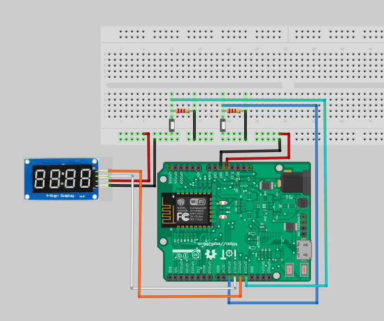

Module LED 7 đoạn - 4 số
-----------------

Demo
====

.. youtube:: https://www.youtube.com/watch?v=_-uuQLz9slU

Chuẩn bị
========

+--------------------+----------------------------------------------------------+
| **Tên board mạch** | **Link**                                                 |
+====================+==========================================================+
| Board IoT Wifi Uno | https://iotmaker.vn/esp8266-iot-wifi-uno.html            |
+--------------------+----------------------------------------------------------+
| Module LED 7 đoạn  | https://iotmaker.vn/module-led-7-doan-4so.html           |
| 4 số                           |                                                          |
+--------------------+----------------------------------------------------------+

Đấu nối
=======

Cài đặt thư viện
================

+--------------------+----------------------------------------------------------+
| **Thư viện**       | **Link**                                                 |
+====================+==========================================================+
| OLED               | https://github.com/squix78/esp8266-oled-ssd1306          |
+--------------------+----------------------------------------------------------+
| Thư viện TM1637    | https://github.com/avishorp/TM1637                       |
| Display            |                                                          |
+--------------------+----------------------------------------------------------+

Lập trình
=========

.. code:: cpp

  #include <TM1637Display.h>

  #define upButton 14
  #define downButton 15

  #define CLK 12
  #define DIO 13

  TM1637Display display(CLK, DIO);

  boolean upLastButton = LOW;
  boolean downLastButton = LOW;
  boolean upCurrentButton = LOW;
  boolean downCurrentButton = LOW;

  int numCounter = 0;

  void setup() 
  {
    display.setBrightness(0x0a);
    pinMode(upButton, INPUT);
    pinMode(downButton, INPUT);
  }

  void loop() 
  {
    upCurrentButton = upDebounce(upLastButton);
    downCurrentButton = downDebounce(downLastButton);
    
    if(upLastButton == LOW && upCurrentButton == HIGH)
    {
      numCounter++;
    }

    if(downLastButton == LOW && downCurrentButton == HIGH)
    {
      numCounter--;
    }

    display.showNumberDec(numCounter);
    
    upLastButton = upCurrentButton;
    downLastButton = downCurrentButton;
  }

  boolean upDebounce(boolean upLast)
  {
    boolean upCurrent = digitalRead(upButton);
    if (upLast != upCurrent)
    {
      delay(5);
      upCurrent = digitalRead(upButton);
    }
    return upCurrent;
  }

  boolean downDebounce(boolean downLast)
  {
    boolean downCurrent = digitalRead(downButton);
    if (downLast != downCurrent)
    {
      delay(5);
      downCurrent = digitalRead(downButton);
    }
    return downCurrent;
  }

Lưu ý
=====

* Có thể xem hướng dẫn cài đặt thư viện tại `đây <https://www.arduino.cc/en/guide/libraries>`_
* Có thể sử dụng OLED ``SS1306`` bằng cách thay đổi ``SSD1306  display(0x3c, 4, 5);``

