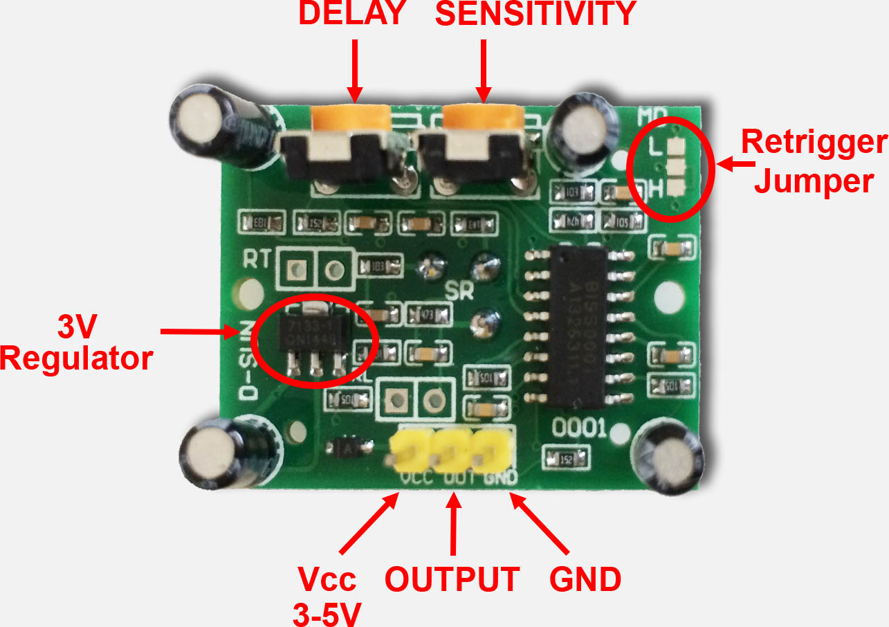

Cảm biến chuyển động HC-SR501 - Hiển thị ra OLED
-----------------

Demo
====

.. youtube:: https://www.youtube.com/watch?v=rfkNhG_70Hg&feature=youtu.be

Chuẩn bị
========

+--------------------+----------------------------------------------------------+
| **Tên board mạch** | **Link**                                                 |
+====================+==========================================================+
| Board IoT Wifi Uno | https://iotmaker.vn/esp8266-iot-wifi-uno.html            |
+--------------------+----------------------------------------------------------+
| OLED 128x64 SH1106 | https://iotmaker.vn/ssd1306-oled-096inch-128x64-i2c.html |
| hoặc SSD1306       |                                                          |
+--------------------+----------------------------------------------------------+
| Cảm biến chuyển    | https://iotmaker.vn/chuyen-dong-hc-sr501.html            |
| động HC-SR51       |                                                          |
+--------------------+----------------------------------------------------------+

Đấu nối
=======

+--------------------+------------------------------+
| **HC-SR501**       | **IoT WiFi Uno**         |
+====================+==============================+
| VCC                | 3.3V                         |
+--------------------+------------------------------+
| OUTPUT             | GPIO2                        |
+--------------------+------------------------------+
| GND                | GND                          |
+--------------------+------------------------------+

Biến trở Delay: Điều chỉnh thời gian trể trong khoảng 0.5-200s.

Biến trở Sensitivity: Điều chỉnh độ nhạy cho cảm biến.

Cài đặt thư viện
================

+--------------------+----------------------------------------------------------+
| **Thư viện**       | **Link**                                                 |
+====================+==========================================================+
| OLED               | https://github.com/squix78/esp8266-oled-ssd1306          |
+--------------------+----------------------------------------------------------+

Lập trình
=========

.. code:: cpp

  #include "SSD1306.h"

  int InputPin = 2;   //using digital pin10 as input
  int ledPin = 16;
  bool Pin_Status = LOW;
  bool PIR_State = LOW; //LOW = no motion, HIGH = motion

  SSD1306  display(0x3c, 4, 5);

  void setup() 
  {
    display.init();
    display.flipScreenVertically();
    display.setFont(ArialMT_Plain_16);
    display.drawString(15, 20, "IotMaker.VN");
    display.display();
    delay(2000);
    
    pinMode(InputPin, INPUT);  //input declaration
    pinMode(ledPin, OUTPUT);
    Serial.begin(115200);
  }
  void loop() 
  {
    Pin_Status = digitalRead(InputPin);
    if (Pin_Status == HIGH) 
    {
      if (PIR_State == LOW) 
      {
        display.clear();
        display.setFont(ArialMT_Plain_16);
        display.drawString(30, 20, "Motion");
        display.display();
        digitalWrite(ledPin, LOW);
        PIR_State = HIGH;
      }
    } 
    else 
    {
      if (PIR_State == HIGH) 
      {
        display.clear();
        display.setFont(ArialMT_Plain_16);
        display.drawString(20, 20, "Not Motion");
        display.display();
        digitalWrite(ledPin, HIGH);
        PIR_State = LOW;
      }
    }
  }

Lưu ý
=====

* Có thể xem hướng dẫn cài đặt thư viện tại `đây <https://www.arduino.cc/en/guide/libraries>`_
* Có thể sử dụng OLED ``SS1306`` bằng cách thay đổi ``SSD1306  display(0x3c, 4, 5);``

