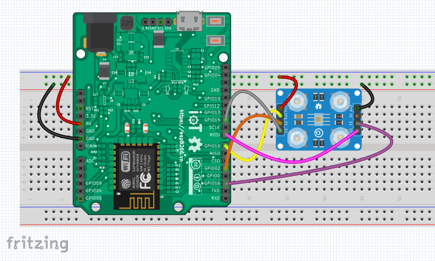

Phát hiện màu sắc và hiển thị màu đọc được ra OLED
--------------------------------------------------

Demo
====

.. youtube:: https://www.youtube.com/watch?v=Tzg2iAMkKYc

Chuẩn bị
========

+--------------------+----------------------------------------------------------+
| **Tên board mạch** | **Link**                                                 |
+====================+==========================================================+
| Board IoT Wifi Uno | https://iotmaker.vn/esp8266-iot-wifi-uno.html            |
+--------------------+----------------------------------------------------------+
| OLED 128x64 SH1106 | https://iotmaker.vn/ssd1306-oled-096inch-128x64-i2c.html |
| hoặc SSD1306       |                                                          |
+--------------------+----------------------------------------------------------+
| Cảm biến màu sắc   | https://iotmaker.vn/tcs3200-cam-bien-mau-sac.html        |
|     TCS3200        |                                                          |
+--------------------+----------------------------------------------------------+

Đấu nối
=======

Cài đặt thư viện
================

+--------------------+----------------------------------------------------------+
| **Thư viện**       | **Link**                                                 |
+====================+==========================================================+
| OLED               | https://github.com/squix78/esp8266-oled-ssd1306          |
+--------------------+----------------------------------------------------------+

Video Cài đặt
=============

.. youtube:: https://www.youtube.com/watch?v=bkH-wATlyNU

Lập trình
=========

.. code:: cpp

    #include "SSD1306.h"
    #include "Wire.h"

    SSD1306  display(0x3c, 4, 5);
    // SH1106 display(0x3c, D3, D5);

    // Pins in definition
    const int s0 = MOSI;
    const int s1 = 16;
    const int s2 = 2;
    const int s3 = 15;
    const int sensorData = 10;
    const int ledRed = 12;
    const int ledGreen = 14;
    const int ledBlue = 13;
    // variable to store value of R,G,B
    int dataR = 0;
    int dataG = 0;
    int dataB = 0;
    int dataY = 0;

    void setup()
    {
      // PINs configuration
      pinMode(s0, OUTPUT);
      pinMode(s1, OUTPUT);
      pinMode(s2, OUTPUT);
      pinMode(s3, OUTPUT);
      pinMode(sensorData, INPUT);
      // Serial baude rate setup
      Serial.begin(9600);
      Serial.println();

      display.init();
      display.flipScreenVertically();
      display.setFont(ArialMT_Plain_10);
      display.drawString(35, 15, "color sensor"); //write text in OLED when it's start.
      display.drawString(35, 35, "_IoTmaker.vn_");
      display.display();
      // Frequency scale
      digitalWrite(s0, HIGH);
      digitalWrite(s1, HIGH);
    }
    void loop()
    {
      display.clear();
      /*********************** getting the RED COLOR data ************************/
      // Set S2 and S3 to LOW in order to sense the RED color
      digitalWrite(s2, LOW);
      digitalWrite(s3, LOW);
      // store data in the Global varibale
      dataR = pulseIn(sensorData, LOW);
      // Display data through the Serial monitor
      Serial.print("Red data= ");
      Serial.print(dataR);
      Serial.print(" ");
      delay(10);
      /*********************** getting the GREEN COLOR data ************************/
      digitalWrite(s2, HIGH);
      digitalWrite(s3, HIGH);
      dataG = pulseIn(sensorData, LOW);
      Serial.print("Green data= ");
      Serial.print(dataG);
      Serial.print(" ");
      delay(10);
      /*********************** getting the BLUE COLOR data ************************/
      digitalWrite(s2, LOW);
      digitalWrite(s3, HIGH);
      dataB = pulseIn(sensorData, LOW);
      Serial.print("Blue data= ");
      Serial.print(dataB);
      Serial.println(" ");
      delay(10);

      bool isRed();
      bool isGreen();
      bool isBlue();
      bool isYellow();
      bool isNoColor();

      if (isRed())
      {
        
        display.drawString(35, 15, "RED COLOR");
        display.drawString(35, 35, "_IoTmaker.vn_");

        analogWrite(ledRed, 1023);
        analogWrite(ledGreen, 0);
        analogWrite(ledBlue, 0);

        display.display();
        delay(100);
        display.clear();
      }
      if (isBlue())
      {
        display.drawString(35, 15, "BLUE COLOR");
        display.drawString(35, 35, "_IoTmaker.vn_");

        analogWrite(ledRed, 0);
        analogWrite(ledGreen, 0);
        analogWrite(ledBlue, 1023);

        display.display();
        delay(100);
        display.clear();
      }
      if (isGreen())
      {
        display.drawString(35, 15, "GREEN COLOR");
        display.drawString(35, 35, "_IoTmaker.vn_");

        analogWrite(ledRed, 0);
        analogWrite(ledGreen, 1023);
        analogWrite(ledBlue, 0);

        display.display();
        delay(100);
        display.clear();
      }
      if (isYellow())
      {
        display.drawString(35, 15, "YELLOW COLOR");
        display.drawString(35, 35, "_IoTmaker.vn_");

        analogWrite(ledRed, 1023);
        analogWrite(ledGreen, 1023);
        analogWrite(ledBlue, 1023);

        display.display();
        delay(100);
        display.clear();
      }
      if (isNoColor())
      {
        display.drawString(35, 15, "NO -COlOR");
        display.drawString(35, 35, "_IoTmaker.vn_");

        analogWrite(ledRed, 0);
        analogWrite(ledGreen, 0);
        analogWrite(ledBlue, 0);

        display.display();
        delay(100);
        display.clear();   
      }

      delay(300);
    }

    bool isRed()
    {
      if ((dataR <= 700 && dataR >= 600) && (dataG <= 1450 && dataG >= 1185) && (dataB <= 1080 && dataB >= 930))
      {
        return true;
      }
      else
      {
        return false;
      }
    }

    bool isGreen()
    {
      if ((dataR <= 1400 && dataR >= 1240) && (dataG <= 1330 && dataG >= 1050) && (dataB <= 1150 && dataB >= 900))
      {
        return true;
      }
      else
      {
        return false;
      }
    }

    bool isBlue()
    {
      if ((dataR <= 11  40 && dataR >= 900) && (dataG <= 950 && dataG >= 750) && (dataB <= 700 && dataB >= 430))
      {
        return true;
      }
      else
      {
        return false;
      }
    }

    bool isYellow()
    {
      if ((dataR <= 720 && dataR >= 550) && (dataG <= 1100 && dataG >= 800) && (dataB <= 1200   && dataB >= 1070))
      {
        return true;
      }
      else
      {
        return false;
      }
    }
    bool isNoColor()
    {
      if ((dataR >=1620) && (dataG >= 2150) && (dataB >= 1700))
      {
        return true;
      }
      else
      {
        return false;
      }
    }

Lưu ý
=====

* Có thể xem hướng dẫn cài đặt thư viện tại `đây <https://www.arduino.cc/en/guide/libraries>`_
* Kết nối 2 chân VCC và 2 chân GND của module TCS3200 lần lượt với nguồn 5VDC và GND trên board ESP8266.

