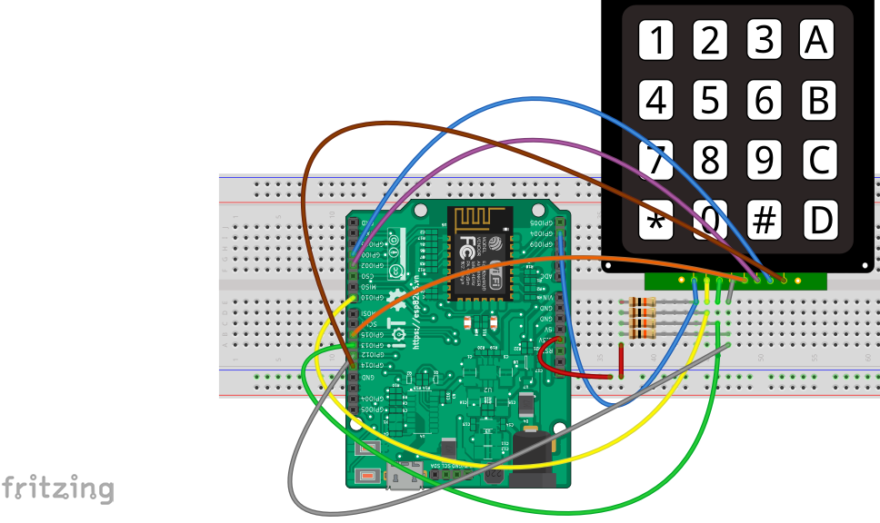

Đọc giá trị phím nhấn từ bàn phím ma trận, hiển thị lên OLED
------------------------------------------------------------

Demo
====

.. youtube:: https://www.youtube.com/watch?v=Jslzw9psto

Chuẩn bị
========

+--------------------+----------------------------------------------------------+
| **Tên board mạch** | **Link**                                                 |
+====================+==========================================================+
| Board IoT Wifi Uno | https://iotmaker.vn/esp8266-iot-wifi-uno.html            |
+--------------------+----------------------------------------------------------+
| OLED 128x64 SH1106 | https://iotmaker.vn/ssd1306-oled-096inch-128x64-i2c.html |
| hoặc SSD1306       |                                                          |
+--------------------+----------------------------------------------------------+
| Keypad matrix 4x4  | https://iotmaker.vn/ban-phim-ma-tran-4x4.html            |
|                    |                                                          |
+--------------------+----------------------------------------------------------+

Đấu nối
=======

Cài đặt thư viện
================

+--------------------+----------------------------------------------------------+
| **Thư viện**       | **Link**                                                 |
+====================+==========================================================+
| OLED               | https://github.com/squix78/esp8266-oled-ssd1306          |
+--------------------+----------------------------------------------------------+

Video Cài đặt
=============

.. youtube:: https://www.youtube.com/watch?v=bkH-wATlyNU

Lập trình
=========

.. code:: cpp
#include "SSD1306.h"
#include "Wire.h"

//declare columns
int col1 = 14;
int col2 = 5;
int col3 = 2;
int col4 = 15;
////declare rows
int row1 = 12;
int row2 = 13;
int row3 = 10;
int row4 = 4;

SSD1306  display(0x3c, 4, 5);
// SH1106 display(0x3c, D3, D5);

char keyName[16] = {'D', 'C', 'B', 'A',
                    '#', '9', '6', '3',
                    '0', '8', '5', '2',
                    '*', '7', '4', '1'
                   };
void _controlCol( char colName, int stage);
void _initKeypad(void);
char _scanKeypad(void);
/*-------------------------------------------------------*/
void setup() {

  //setup stage of pins
  pinMode(row1, INPUT);
  pinMode(row2, INPUT);
  pinMode(row3, INPUT);
  pinMode(row4, INPUT);
  pinMode(col1, OUTPUT);
  pinMode(col2, OUTPUT);
  pinMode(col3, OUTPUT);
  pinMode(col4, OUTPUT);

  display.init();
  display.flipScreenVertically();
  display.setFont(ArialMT_Plain_16);
  display.drawString(35, 15, "Keypad_4x4"); //write text in OLED when it's start.
  display.drawString(35, 35, "IoTmaker");
  display.display();
  Serial.begin(57600);
  Serial.println("Scan keypad 4x4");
  _initKeypad();
  delay(50);
}
/*-------------------------------------------------------*/
void loop() {
  display.clear();
  int key;
  int temp = 0;
  key = _scanKeypad();
  temp = key;
  if (key != 0)
  {
    Serial.print("The key being pressed:");
    Serial.println(keyName[temp - 1]);
    display.drawString(35, 15, "pressed");
    display.drawString(35, 35, keyName[temp - 1);
                       display.display();
                       delay(100);
  }
  delay(200);
}
/*-------------------------------------------------------*/
void _initKeypad(void)
{
  char i = 0;
  for (i = 1; i <= 4; i++) // val i is column
  {
    _controlCol(i, 1); // set columns is HIGH level
  }
}
/*-------------------------------------------------------*/
void _controlCol(char colName, int stage)
{
  switch (colName)
  {
    case (1): // column 1;
      {
        digitalWrite(col1, stage);
        break;
      }
    case (2): // column 2;
      {
        digitalWrite(col2, stage);
        break;
      }
    case (3): // column 3;
      {
        digitalWrite(col3, stage);
        break;
      }
    case (4): // column 4;
      {
        digitalWrite(col4, stage);
        break;
      }
  }
}
/*-------------------------------------------------------*/
char _scanKeypad(void)
{
  int key = 0;

  //Scan column 1;
  _controlCol(1, 0);
  if (digitalRead(row1) == 0) key = 1;
  if (digitalRead(row2) == 0) key = 2;
  if (digitalRead(row3) == 0) key = 3;
  if (digitalRead(row4) == 0) key = 4;
  _controlCol(1, 1);

  //Scan column 2;
  _controlCol(2, 0);
  if (digitalRead(row1) == 0) key = 5;
  if (digitalRead(row2) == 0) key = 6;
  if (digitalRead(row3) == 0) key = 7;
  if (digitalRead(row4) == 0) key = 8;
  _controlCol(2, 1);

  //Scan column 3;
  _controlCol(3, 0);
  if (digitalRead(row1) == 0) key = 9;
  if (digitalRead(row2) == 0) key = 10;
  if (digitalRead(row3) == 0) key = 11;
  if (digitalRead(row4) == 0) key = 12;
  _controlCol(3, 1);

  //Scan column 4;
  _controlCol(4, 0);
  if (digitalRead(row1) == 0) key = 13;
  if (digitalRead(row2) == 0) key = 14;
  if (digitalRead(row3) == 0) key = 15;
  if (digitalRead(row4) == 0) key = 16;
  _controlCol(4, 1);

  return key;
}

Lưu ý
=====

* Có thể xem hướng dẫn cài đặt thư viện tại `đây <https://www.arduino.cc/en/guide/libraries>`_
* Để giảm số chân kết nối đến board esp8266, có thể dùng phương pháp 1 chân ADC để đọc giá trị của các phím nhấn.
* tham khảo đường dẫn 
