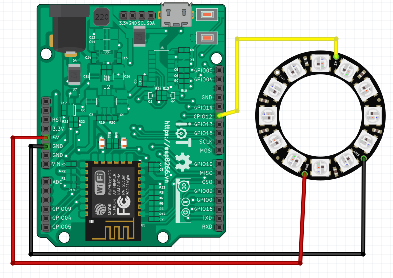

Điều khiển Vòng 8/12/16 LED RGB
-----------------

Demo
====

.. youtube:: https://www.youtube.com/watch?v=9hatakXh0rE

Chuẩn bị
========

+--------------------+----------------------------------------------------------+
| **Tên board mạch** | **Link**                                                 |
+====================+==========================================================+
| Board IoT Wifi Uno | https://iotmaker.vn/esp8266-iot-wifi-uno.html            |
+--------------------+----------------------------------------------------------+
| Vòng 12 LED RGB    | https://iotmaker.vn/12-led-rgb-ws2812-5050.html          |
| WS2812 5050        |                                                          |
+--------------------+----------------------------------------------------------+

Đấu nối
=======

Cài đặt thư viện
================

+--------------------+----------------------------------------------------------+
| **Thư viện**       | **Link**                                                 |
+====================+==========================================================+
| Thư viện Adafruit  | https://github.com/adafruit/Adafruit_NeoPixel            |
| Neopixel           |                                                          |
+--------------------+----------------------------------------------------------+

Lập trình
=========

.. code:: cpp

  #include <Adafruit_NeoPixel.h>

  #define PIN 12

  Adafruit_NeoPixel strip = Adafruit_NeoPixel(12, PIN, NEO_GRB + NEO_KHZ800);

  void setup()
  {
    strip.begin();
    strip.setBrightness(30);
    strip.show();
  }

  void loop() 
  {
    //color(r,g,b) -> (r << 16) | (g < <8) | b
    strip.show();
    colorWipe(strip.Color(255, 0, 0), 50); // Red
    colorWipe(strip.Color(0, 255, 0), 50); // Green
    colorWipe(strip.Color(0, 0, 255), 50); // Blue
    rainbow(16);
    rainbowCycle(16);
  }

  void colorWipe(unsigned int c, unsigned int wait) 
  {
    for (int i = 0; i < strip.numPixels(); i++) //numPixels = numLEDs
    {
      strip.setPixelColor(i, c); //set color for once LED
      strip.show();
      delay(wait);
    }
  }

  //rainbow led for all
  void rainbow(unsigned int wait) 
  {
    int i, j;

    for (j = 0; j < 256; j++) 
    {
      for (i = 0; i < strip.numPixels(); i++) 
      {
        strip.setPixelColor(i, Wheel((i + j) & 255));
      }
      strip.show();
      delay(wait);
    }
  }

  // rainbow circle led
  void rainbowCycle(unsigned int wait) 
  {
    uint16_t i, j;

    for (j = 0; j < 256 * 5; j++) 
    { // 5 cycles of all colors on wheel
      for (i = 0; i < strip.numPixels(); i++) 
      {
        strip.setPixelColor(i, Wheel(((i * 256 / strip.numPixels()) + j) & 255));
      }
      strip.show();
      delay(wait);
    }
  }

  //change LED from green -> red -> blue -> green (full color)
  uint32_t Wheel(byte WheelPos) 
  {
    if (WheelPos < 85) 
    {
      return strip.Color(WheelPos * 3, 255 - WheelPos * 3, 0);
    } 
    else if (WheelPos < 170) 
    {
      WheelPos -= 85;
      return strip.Color(255 - WheelPos * 3, 0, WheelPos * 3);
    }
    else 
    {
      WheelPos -= 170;
      return strip.Color(0, WheelPos * 3, 255 - WheelPos * 3);
    }
  }

Lưu ý
=====

* Có thể thay thế các vòng 8/12/16 LED bằng cách thay thế số 12 bằng số 8 hoặc 16 tại: 
  Adafruit_NeoPixel strip = Adafruit_NeoPixel(12, PIN, NEO_GRB + NEO_KHZ800);

