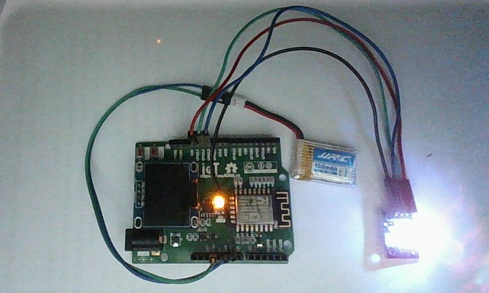

Moudule led 3 màu RGB 
---------------------------------

Demo
====

.. youtube:: https://www.youtube.com/watch?v=WG26TwyPD5A

Chuẩn bị
========

+---------------------------+----------------------------------------------------------+
|    **Tên board mạch**     | **Link**                                                 |
+===========================+==========================================================+
|    Board IoT Wifi Uno     | https://iotmaker.vn/esp8266-iot-wifi-uno.html            |
+---------------------------+----------------------------------------------------------+
|   Moudule led 3 màu RGB   | https://iotmaker.vn/module-led-3-mau-rgb.html            |
+---------------------------+----------------------------------------------------------+

Đấu nối
=======

Lập trình
=========

.. code:: cpp

  void setColor(int red, int green, int blue);

  #define PinR  14
  #define PinG  12
  #define PinB  13

  char R = 100, G = 100, B = 100;

  void setup()
  {
    Serial.begin(115200);
    pinMode(PinR, OUTPUT);
    pinMode(PinG, OUTPUT);
    pinMode(PinB, OUTPUT);
    analogWriteRange(255);
    analogWriteFreq(1000);
    setColor(255, 150, 0);
  }

  void loop()
  {

    R += 5;
    B += rand() * 10;
    G += rand() * 10;
    setColor(R, G, B);
    delay(100);
  }

  void setColor(int red, int green, int blue)
  {
    red = 255 - red;
    green = 255 - green;
    blue = 255 - blue;
    analogWrite(PinR, red);
    analogWrite(PinG, green);
    analogWrite(PinB, blue);
  }

Lưu ý
=====

* Để nạp chương trình được thuận lợi, nên kết nối module led sau khi đã nạp chương trình xong.

