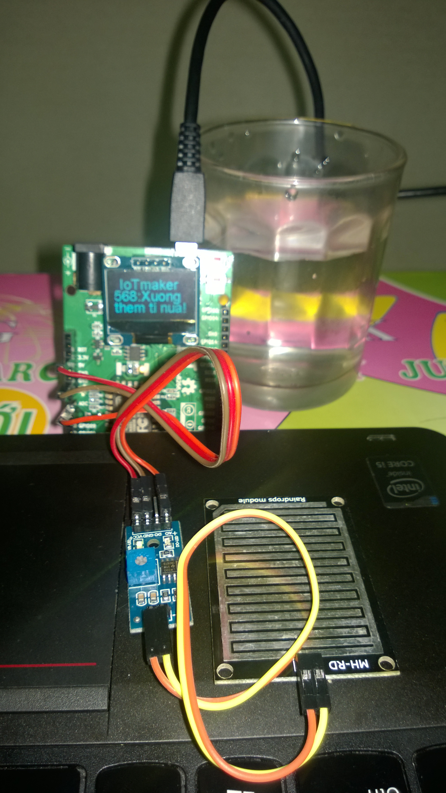

Dự báo mực nước với cảm biến mưa            
--------------------------------------------

Demo
====

.. youtube:: https://www.youtube.com/watch?v=Xyft05a5x0g

Chuẩn bị
========

+---------------------------+----------------------------------------------------------+
|    **Tên board mạch**     | **Link**                                                 |
+===========================+==========================================================+
|    Board IoT Wifi Uno     | https://iotmaker.vn/esp8266-iot-wifi-uno.html            |
+---------------------------+----------------------------------------------------------+
|    Cảm biến mưa    | https://iotmaker.vn/cam-bien-mua.html                    |
+---------------------------+----------------------------------------------------------+

Đấu nối
=======

Cài đặt thư viện
================

+--------------------+----------------------------------------------------------+
| **Thư viện**       | **Link**                                                 |
+====================+==========================================================+
| OLED               | https://github.com/squix78/esp8266-oled-ssd1306          |
+--------------------+----------------------------------------------------------+

Lập trình
=========

.. code:: cpp

#include "SSD1306.h" // alias for `#include "SSD1306Wire.h"`
#include <Wire.h>  

// IoT Wifi Uno-----Cam bien mua
//      ADC---------------A0
//      3.3V--------------VCC
//      GND---------------GND

int nRainIn = 0;          // khai bao chan ADC
int nRainVal;             // bien de doc gia tri ADC
SSD1306  display(0x3c, 4, 5);

char temperatureCString[10];

void setup() {
  Serial.begin(9600);
  display.init();
  display.flipScreenVertically();
  display.setFont(ArialMT_Plain_24); // size chu
  pinMode(2, INPUT_PULLUP);
}
void loop() 
{
  nRainVal = analogRead(nRainIn); 
  Serial.print("\t Moisture Level: ");
  Serial.println(nRainVal);

  display.clear();
  display.drawString(0, 20, String(nRainVal)); // hien thi gia tri ADC  
  display.drawString(10, 0, "IoTmaker");

  if(nRainVal < 320)
  {
    display.drawString(40, 20, ":STOP");
    display.drawString(00, 40, "the nay thoi");
  }
  else
  {
    display.drawString(40, 20, ":Xuong");
    display.drawString(0, 40, "them ti nua!");
  }
  
  display.display();
  delay(60);

}

Lưu ý
=====

* Trong ví dụ trên sử dụng A0 của cảm biến.
