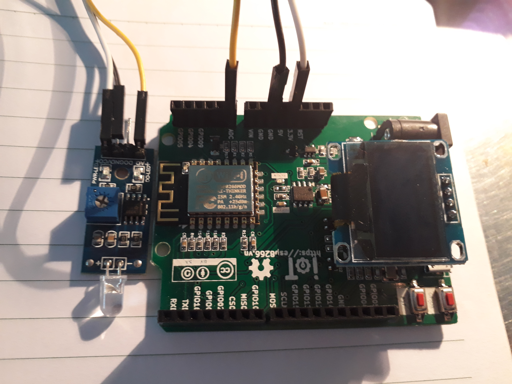

Sensor photodiode
-----------------

Demo
====

.. youtube:: https://www.youtube.com/watch?v=pjekCHFF6cw
.. youtube:: https://www.youtube.com/watch?v=9zEVciTSalU

Chuẩn bị
========

+--------------------+----------------------------------------------------------+
| **Tên board mạch** | **Link**                                                 |
+====================+==========================================================+
| Board IoT Wifi Uno | https://iotmaker.vn/esp8266-iot-wifi-uno.html            |
+--------------------+----------------------------------------------------------+
| OLED 128x64 SH1106 | https://iotmaker.vn/ssd1306-oled-096inch-128x64-i2c.html |
| hoặc SSD1306       |                                                          |
+--------------------+----------------------------------------------------------+
| Module sensor      | https://iotmaker.vn/cam-bien-anh-sang-photodiod.html     |
| photodiode         |                                                          |
+--------------------+----------------------------------------------------------+

Đấu nối
=======

Cài đặt thư viện
================

+--------------------+----------------------------------------------------------+
| **Thư viện**       | **Link**                                                 |
+====================+==========================================================+
| OLED               | https://github.com/squix78/esp8266-oled-ssd1306          |
+--------------------+----------------------------------------------------------+

Lập trình
=========

.. code:: cpp

  #include "SSD1306.h"

  SSD1306  display(0x3c, 4, 5);
  // SH1106 display(0x3c, D3, D5);
  int Output_control = 13;       // set control pin is pin13;
  int V_level = LOW;
  int val = 0;         // variable to store the read value
  void setup() {
    pinMode(Output_control, OUTPUT);
    Serial.begin(115200);
    Serial.println();
    Serial.println();

    // Initialising the UI will init the display too.
    display.init();

    display.flipScreenVertically();
    display.setFont(ArialMT_Plain_10);
    display.drawString(0, 0, "Sensor photodiode"); //write "sensordiode in OLED when it's start.
    display.display();

    
  }

  void loop() {
    display.clear();
    val = analogRead(A0);   // variable to read the value input
    display.drawString(0, 0, "val=" + String(val));
    if ( val >= 256)
      V_level = HIGH;
    else
      V_level = LOW;
    digitalWrite(Output_control, V_level);
    display.display();
    delay(0.1);

  }

