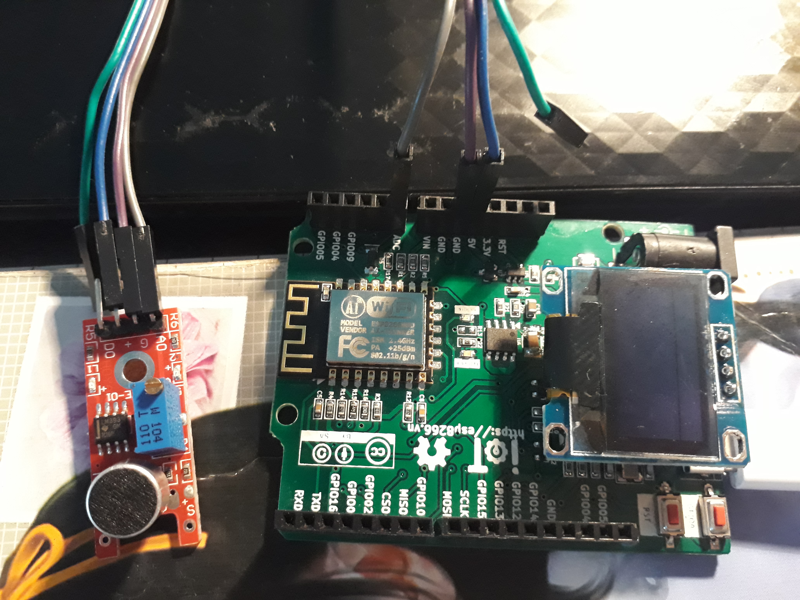

Đo cường độ âm thanh, hiển thị trên OLED
---------------------------------------

Demo
====

.. youtube:: https://www.youtube.com/watch?v=Jslzw9pstok

Chuẩn bị
========

+--------------------+----------------------------------------------------------+
| **Tên board mạch** | **Link**                                                 |
+====================+==========================================================+
| Board IoT Wifi Uno | https://iotmaker.vn/esp8266-iot-wifi-uno.html            |
+--------------------+----------------------------------------------------------+
| OLED 128x64 SH1106 | https://iotmaker.vn/ssd1306-oled-096inch-128x64-i2c.html |
| hoặc SSD1306       |                                                          |
+--------------------+----------------------------------------------------------+
| Cảm biến âm thanh  | https://iotmaker.vn/cam-bien-am-thanh.html               |
|                    |                                                          |
+--------------------+----------------------------------------------------------+

Đấu nối
=======

Bảng đấu nối
=============

+-------------------------+--------------------+
| **Module voice sensor** | **Board esp8266**  |
+=========================+====================+
|           A0            |      ADC           |
+-------------------------+--------------------+
|           G             |      GND           |
+-------------------------+--------------------+
|           '+'           |       5V           |
+-------------------------+--------------------+

Cài đặt thư viện
================

+--------------------+----------------------------------------------------------+
| **Thư viện**       | **Link**                                                 |
+====================+==========================================================+
| OLED               | https://github.com/squix78/esp8266-oled-ssd1306          |
+--------------------+----------------------------------------------------------+

Video Cài đặt
=============

.. youtube:: https://www.youtube.com/watch?v=bkH-wATlyNU

Lập trình
=========

.. code:: cpp

	#include "SSD1306.h"

	SSD1306  display(0x3c, 4, 5);
	// SH1106 display(0x3c, D3, D5);
	int Output_control_1 = 10;       // set control pin is pin10;
	int Output_control_2 = 13;       // set control pin is pin13;
	int V_level_1 = LOW;
	int V_level_2 = LOW;
	int voiceValue = 0;         // variable to store the read value
	void setup() {
	  pinMode(Output_control_1, OUTPUT);
	  pinMode(Output_control_2, OUTPUT);
	  Serial.begin(115200);
	  Serial.println();
	  Serial.println();

	  // Initialising the UI will init the display too.
	  display.init();

	  display.flipScreenVertically();
	  display.setFont(ArialMT_Plain_10);
	  display.drawString(0, 0, "Voice sensor"); //write "sensordiode in OLED when it's start.
	  display.display();
	  
	}
	void loop() {
	 
	  display.clear();
	  voiceValue = analogRead(A0);   //read the input pin
	  display.drawString(0, 0, "Voice val =" + String(voiceValue));
	  if ( voiceValue < 23){
	    V_level_1 = HIGH;
	    V_level_2 = LOW;
	  } 
	  else if ( (voiceValue >=23) && (voiceValue <= 25) ) {
	    V_level_1 = LOW;
	    V_level_2 = HIGH;
	  }
	  else {
	    V_level_1 = HIGH ;
	    V_level_2 = HIGH;    
	  }
	  
	  digitalWrite(Output_control_1, V_level_1);
	  digitalWrite(Output_control_2, V_level_2);
	  display.display();
	  delay(1);

	}

Lưu ý
=====

* Có thể xem hướng dẫn cài đặt thư viện tại `đây <https://www.arduino.cc/en/guide/libraries>`_
* Ngoài ra Module cảm biến âm thanh còn có 1 chân tín hiệu D0(dạng digital), cường độ âm thanh chỉ hiển thị 2 giá trị analog tương ứng với 2 mốc 0,1.

