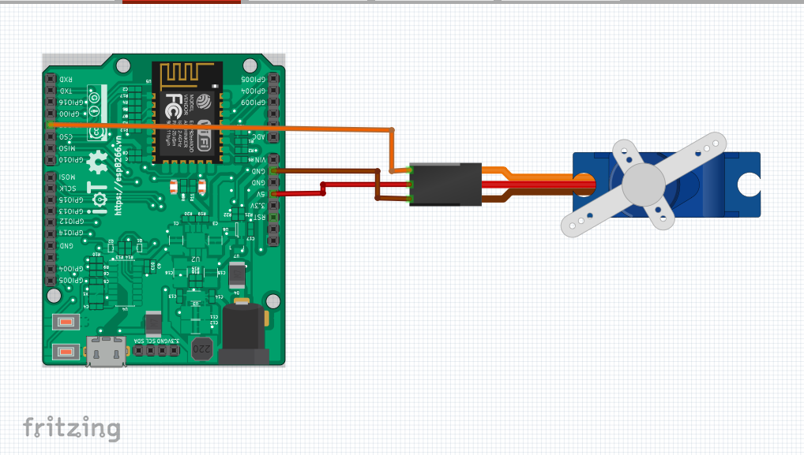

Điều khiển góc quay của động cơ servo, hiển thị giá trị góc quay trên OLED.
--------------------------------------------------------------------------

Demo
====

.. youtube:: https://www.youtube.com/watch?v=vLtSuu2njO8

Chuẩn bị
========

+--------------------+----------------------------------------------------------+
| **Tên board mạch** | **Link**                                                 |
+====================+==========================================================+
| Board IoT Wifi Uno | https://iotmaker.vn/esp8266-iot-wifi-uno.html            |
+--------------------+----------------------------------------------------------+
| OLED 128x64 SH1106 | https://iotmaker.vn/ssd1306-oled-096inch-128x64-i2c.html |
| hoặc SSD1306       |                                                          |
+--------------------+----------------------------------------------------------+
| Động cơ RC Servo   | https://iotmaker.vn/dong-co-rc-servo-9g-sg90.html        |
|    9G SG90         |                                                          |
+--------------------+----------------------------------------------------------+

Đấu nối
=======

Cài đặt thư viện
================

+--------------------+----------------------------------------------------------+
| **Thư viện**       | **Link**                                                 |
+====================+==========================================================+
| OLED               | https://github.com/squix78/esp8266-oled-ssd1306          |
+--------------------+----------------------------------------------------------+

Video Cài đặt
=============

.. youtube:: https://www.youtube.com/watch?v=bkH-wATlyNU

Lập trình
=========

.. code:: cpp

    #include <Servo.h>
    #include "SSD1306.h"
    #include "Wire.h"
    #define SERVO_PIN 2
    SSD1306  display(0x3c, 4, 5);
    // SH1106 display(0x3c, D3, D5);

    Servo myservo1;
    int pos = 0;
    void setup() {
      myservo1.attach(SERVO_PIN);
      Serial.begin(9600);
      Serial.println();

      display.init();
      display.flipScreenVertically();
      display.setFont(ArialMT_Plain_10);
      display.drawString(35, 15, "servo motor"); //write text in OLED when it's start.
      display.drawString(35, 35, "_IoTmaker.vn_");
      display.display();

    }
    void loop() {
      display.clear();
      for ( pos = 0; pos <= 180; pos += 5) {
        display.drawString(35, 15, "Rotation:" + String(pos));
        display.drawString(35, 35, "_IoTmaker.vn_");
        display.display();
        myservo1.write(pos);
        Serial.print("Pos= ");
        Serial.print(pos);
        Serial.println();
        delay(100);
        display.clear();
      }
      for ( pos = 180; pos >= 0; pos -= 5) {
        display.drawString(35, 15, "Rotation:" + String(pos));
        display.drawString(35, 35, "_IoTmaker.vn_");
        display.display();
        myservo1.write(pos);
        Serial.print("Pos= ");
        Serial.print(pos);
        Serial.println();
        delay(100);
        display.clear();
      }
      delay(500);
    }

Lưu ý
=====

* Có thể xem hướng dẫn cài đặt thư viện tại `đây <https://www.arduino.cc/en/guide/libraries>`_

