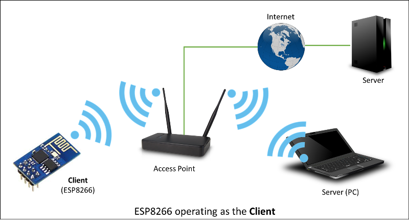

Lớp Client
===========

Lớp Client (Client class) trong thư viện ESP8266WiFi cho phép module ESP8266 làm việc ở chế độ client đẻ có thể truy cập vào các dịch vụ cung cấp bởi server để có thẻ gởi, nhận và xử lí dữ liệu

* :ref:`Các hàm trong lớp Client0`
  - :ref:`WiFiClient0` 
  - :ref:`connected0`
  - :ref:`connect0`
  - :ref:`write0`
  - :ref:`print0`
  - :ref:`println0`
  - :ref:`available0`
  - :ref:`read0`
  - :ref:`flush0`
  - :ref:`stop0`

* :ref:`phuongthucget0` 
* :ref:`vidu0` 

.. _Các hàm trong lớp Client0:

Các hàm trong lớp Client
^^^^^^^^^^^^^^^^^^^^^^^^^

.. _WiFiClient0:

WiFiClient
~~~~~~~~~~~~~

WiFiClient giúp khai báo một biến là client. 

.. code:: cpp

  WiFiClient client // tạo một biến tên client là client trong mô hình client-server

.. _connected0:

connected()
~~~~~~~~~~~~~

Hàm trả về true nếu client còn kết nối tới mạng và trả về false nếu client ngắt kết nối.

.. code:: cpp

 client.connected() 

.. _connect0:

connect()
~~~~~~~~~~~~

Kết nối tới địa chỉ IP với port cụ thể, hoặc kết nối tới URL với port cụ thể. Kiểu trả về là true nếu kết nối thành công, false nếu kết nối thất bại. 

.. code:: cpp
 
 client.connect(ip,port)
 client.connect(URL,port)

Lưu ý rằng hàm chỉ thực hiện được sau khi module ÈSP8266 đã kết nối vào WiFi thành công do đó nếu muốn thưc hiện hàm này thì trước tiên phải kết nối module ÈSP8266 với WiFi.

**Ví dụ**

.. code-block:: cpp

 #include <ESP8266WiFi.h>

 const char* ssid = "IOTMAKER.VN";
 const char* password = "**********";

 const char* host = "www.youtube.com";

 void setup()
 {   WiFiClient client;

  Serial.begin(115200);
  Serial.println();

  Serial.printf("Connecting to %s ", ssid);
  WiFi.begin(ssid, password);
  while (WiFi.status() != WL_CONNECTED)
  {
    delay(500);
    Serial.print(".");
  }
  Serial.println(" connect thanh cong");

  Serial.printf("\n[Connecting to %s ... ", host);
  if (client.connect(host, 80))
  {
    Serial.println("connected to youtube.com");

  }
 }

 void loop()
 { }

**Ouput**
 
.. code-block:: cpp

 Connecting to IOTMAKER.VN ............. connect thanh cong

 [Connecting to www.youtube.com ... connected to youtube.com

.. _write0:

write()
~~~~~~~~~

Ghi data lên server mà client đã kết nối tới.

.. code-block:: cpp

 client.write(data) 

Đối số data có kiểu dữ liệu byte hoặc char.

.. _print0:

print()
~~~~~~~~

Ghi data lên server mà client đã kết nối tới. Ghi một số nhiều chữ số bằng một chuỗi các số 1 một chữ số bằng mã ASCII (ví dụ số 113 sẽ được gởi lên bằng 3 kí tự: '1','1','3').

.. code-block:: cpp

 client.print(data)
 client.print(data, BASE) 

Các đối số:
 
 * data: dữ liệu để ghi lên server (kiểu char, byte, int, long hoặc string)
 * BASE (có thể không dùng): Hệ cơ số của data, BASE có các gía trị DEC (hệ thập phân), OCT (hệ bát phân) và HEX (hệ 16).

.. _println0:

println()
~~~~~~~~~~

Hàm cũng có chức năng như print() như sau khi thưc hiện xong thì xuống hàng tiếp theo. Các cú pháp, đối số, kiểu dữ liệu đều giống như print().

.. code-block:: cpp

 client.println()
 client.println(data)
 client.print(data, BASE) 

.. _available0:

available()
~~~~~~~~~~~

Trả về số byte mà client có thể đọc được, là số lượng dữ liệu được ghi lên client từ server mà client kết nối tới.

.. code-block:: cpp

 client.available() 

**Ví dụ**

Trả về số byte đọc được từ server

.. code-block:: cpp

 #include <ESP8266WiFi.h>

 const char* ssid = "IOTMAKER.VN";
 const char* password = "**********";

 const char* host = "www.youtube.com";

 void setup()
 {   WiFiClient client;

  Serial.begin(115200);
  Serial.println();

  Serial.printf("Connecting to %s ", ssid);
  WiFi.begin(ssid, password);
  while (WiFi.status() != WL_CONNECTED)
  {
    delay(500);
    Serial.print(".");
  }
 
  if (client.connect(host, 80))
  {
    Serial.println("connected to youtube.com");
    Serial.println(client.available());
  }
 }

 void loop()
 {
  }

**Output**

.. code-block:: cpp
 
 Connecting to IOTMAKER.VN ......connected to youtube.com
 0

Kết quả trả về ở đây là 0, tức là không đọc được byte nào từ server.

.. _read0:

read()
~~~~~~~~~

Đọc byte tiếp theo trả về từ server mà client đã kết nối tới.

.. code-block:: cpp

 client.read() 

Hàm không có đối số, trả về byte hoặc kí tự (char) nếu đọc được hoặc trả về -1 nếu không đọc được.

**Ví dụ**

Đọc byte trả về server mà client đã kết nối tới.

.. code-block:: cpp

 #include <ESP8266WiFi.h>

 const char* ssid = "IOTMAKER.VN";
 const char* password = "@iotmaker.vn";

 const char* host = "www.youtube.com";

 void setup()
 {   WiFiClient client;

  Serial.begin(115200);
  Serial.println();

  Serial.printf("Connecting to %s ", ssid);
  WiFi.begin(ssid, password);
  while (WiFi.status() != WL_CONNECTED)
  {
    delay(500);
    Serial.print(".");
  }
 
  if (client.connect(host, 80))
  {
    Serial.println("connected to youtube.com");
    
    Serial.println(client.available());
    Serial.println(client.read());
  
 } }

 void loop()
 {
  
 }

**Output**

.. code-block:: cpp

 Connecting to IOTMAKER.VN ......connected to youtube.com
 0
 -1

Như đã thấy ở phần available(), khi không đọc được byte nào từ server (kết quả trả về là 0), thì ở đây khi dùng lệnh .read()thì kết quả trả về sẽ là -1 (tức là không đọc được byte hoặc char nào trả vê từ server).

.. _flush0:

flush()
~~~~~~~~

Loại bỏ byte đã ghi về client nhưng chưa đọc được.

.. code-block:: cpp

 client.flush() 

.. _stop0:

stop()
~~~~~~~

Ngắt kết nối với server 

.. code-block:: cpp

 client.stop()

.. _phuongthucget0:

Phương thức HTTP GET
^^^^^^^^^^^^^^^^^^^^^

Giao thức HTTP (Hypertext Transfer Protocol) được thiết kế để thiết lập giao tiếp gĩưa client và server.

HTTP sẽ hỗ trợ tính năng request-response (yêu cầu và hồi đáp) gĩưa client và server. Khi đó, 1 web browser có thể là một client và máy chủ của website sẽ là server.

Ví dụ: Một web browser sẽ gởi 1 yêu cầu HTTP (HTTP request) lên cho server, sau đó server sẽ hồi đáp (response) lại thông tin cho client. Thông tin trả về từ server bao gồm các thông tin về yêu cầu (request) mà client đã gởi và nội dung mà client đã yêu cầu.

Giao thức GET trong HTTP được dùng để yêu cầu dữ liệu từ một nguồn cụ thể. 

.. _vidu0:

Ví dụ cụ thể
^^^^^^^^^^^^^^

Để hiểu rõ hơn về các hàm print(), read(), available(), connect(), connected () và phương thức HTTP GET, ta xét ví dụ sau đây

Yêu cầu: Kết nối tới server của youtube.com, gởi yêu cầu server bằng phương thức HTTP GET và hiển thị trên Serial monitor các dữ liệu trả về.

Phân tích: Để gởi yêu cầu lên server của Youtube với phương thức HTTP GET, ta dùng câu lệnh .print() để ghi yêu cầu lên server. Để truyền được yêu cầu HTTP thì client phải kết nối được tới port 80 của server là port dành riêng cho giao thức HTTP. Sau đó, để đọc dữ liệu trả về sever, ta dùng câu lệnh .read().

**Chương trình**

.. code-block:: cpp

 #include <ESP8266WiFi.h>

 const char* ssid = "IOTMAKER.VN";
 const char* password = "************";

 const char* host = "www.youtube.com";

 void setup()
 {
  Serial.begin(115200);
  Serial.println();

  Serial.printf(" kết nối tới WiFi %s ", ssid);
  WiFi.begin(ssid, password);
  while (WiFi.status() != WL_CONNECTED)
  {
    delay(500);
    Serial.print(".");
  }
  Serial.println(" Kết nối tới WiFi thành công ");

  WiFiClient client;

  Serial.printf("\n Kết nối tới %s ... ", host);
  if (client.connect(host, 80)) //port 80 được dành riêng cho giao thức HTTP 
  {
    Serial.println("connected ");

    Serial.println(" gởi request ");
    client.print(String("GET /") + " HTTP/1.1\r\n" +
                 "Host: " + host + "\r\n" +
                 "Connection: close\r\n" +
                 "\r\n"
                );

    Serial.println(" Kết quả trả về: ");
    while (client.connected())
    {
      if (client.available())
      {
        String line = client.readStringUntil('\n');
        Serial.println(line);
      }
    }
    client.stop();
    Serial.println("\n Server disconnected");
  }
  else
  {
    Serial.println("kết nối thất bại ");
    client.stop();
  }
  delay(5000);
 }

 void loop()
 {
  
 }

**Output**

.. code-block:: cpp

 kết nối tới WiFi IOTMAKER.VN ...... Kết nối tới WiFi thành công 

 Kết nối tới www.youtube.com ... connected 
 gởi request 
 Kết quả trả về:
 HTTP/1.1 301 Moved Permanently

 Cache-Control: no-cache

 P3P: CP="This is not a P3P policy! See http://support.google.com/accounts/answer/151657?hl=en for more info."

 X-XSS-Protection: 1; mode=block; report=https://www.google.com/appserve/security-bugs/log/youtube

 Content-Length: 0

 X-Content-Type-Options: nosniff

 Location: https://www.youtube.com/

 Expires: Tue, 27 Apr 1971 19:44:06 EST

 Content-Type: text/html; charset=utf-8

 Date: Fri, 18 Aug 2017 07:52:20 GMT

 Server: YouTubeFrontEnd

 Set-Cookie: VISITOR_INFO1_LIVE=gnydvWKanR0; path=/; domain=.youtube.com; expires=Wed, 18-Apr-2018 19:45:20 GMT; httponly

 Set-Cookie: YSC=6lnqYU1ENu0; path=/; domain=.youtube.com; httponly

 Connection: close

 [Disconnected]

