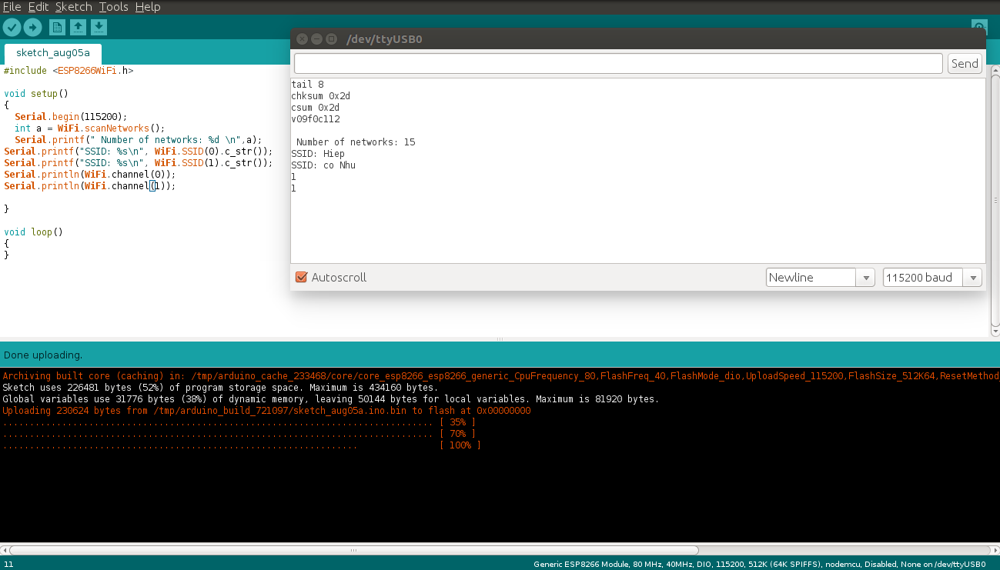

Lớp Scan trong thư viện ESP8266WiFi
===================================

* :ref:`Giới thiệu về lớp Scan0`
  

* :ref:`Scan for Networks0` 

  - :ref:`scanNetworks0` 
  - :ref:`scanComplete0` 

* :ref:`Hiển thị kết quả0` 

  - :ref:`SSID0` 
  - :ref:`scanDelete0` 
  - :ref:`encryptionType0` 
  - :ref:`channel0`
  - :ref:`isHidden0`
  - :ref:`RSSI0`
  - :ref:`BSSID0`
  - :ref:`getNetworkInfo0`

.. _Giới thiệu về lớp Scan0:

Giới thiệu về lớp Scan
^^^^^^^^^^^^^^^^^^^^^^

Đế kết nối smart phone tới một hotspot, ta mở chức năng setting Wifi trên smart phone, tìm Wifi cần kết nối và chọn kết nối. Với ESP8266, ta có thể làm điều tương tự như thế với hàm ``WiFi.scanNetworks()`` cho kết quả trả về là số lượng các WIFI (có mật khẩu và không có mật khẩu) mà module có thế kết nối được.

.. _Scan for Networks0:

Scan for Networks
^^^^^^^^^^^^^^^^^

.. _scanNetworks0:

scanNetworks
~~~~~~~~~~~~~

Hàm scanNetworks thưc hiện scan các Wifi trong vùng mà module có thể kết nối được và kết quả trả về là số lượng các WIFI (ta lập trình để kết quả hiển thị trên Serial Monitor).

.. code:: cpp

   WiFi.scanNetworks()

Ví dụ:

.. code-block:: cpp

  #include <ESP8266WiFi.h>

  void setup()
   {
      Serial.begin(115200);

      Serial.println("** Scan Networks **");

      int numSsid = WiFi.scanNetworks();

      Serial.print("SSID List:");
      Serial.println(numSsid);

   } 
  void loop()
   {

   }

Output:

.. image:: ../_static/wifi/scan-networks.png

.. _scanComplete0:

scanComplete
~~~~~~~~~~~~~

Hàm WiFi.scanComplete() có chức năng tương tự như hàm scanNetworks nhưng thực hiện các chức năng scan bất đồ bộ (asynchronous scanning)

.. code:: cpp

   WiFi.scanComplete()

Kết quả trả về số lượng các mạng Wifi có thể kết nối được (giống như với hàm scanNetworks)

Nếu việc scan chưa thực hiện xong thì có các kết quả trả về:

 * Hàm scan chưa thực hiện xong: -1 
 * Lỗi scan: -2

Ví dụ:

Thực hiện chạy song song 2 hàm scanNetworks và scanComplete, kiểm tra, so sánh kết quả.

.. code-block:: cpp

  #include <ESP8266WiFi.h>

  void setup()
  {
   Serial.begin(115200);
   Serial.println("** Scan Networks **");
   int sN = WiFi.scanNetworks();
   int sC = WiFi.scanComplete();
   Serial.print("**SSID List:**");
	 Serial.println(sN);
	 Serial.printf("Scan Complete %d ", sC);
  }
  void loop()
  {

  }
   
Output:

.. image:: ../_static/wifi/scan-complete.png

.. _Hiển thị kết quả0:

Hiển thị kết quả
^^^^^^^^^^^^^^^^

.. _SSID0:

SSID
~~~~~

Sau khi scan network, kết quả trả về là số các network. Để biết SSID của network với số thứ tự tương ứng trong kết quả về, ta dùng hàm ``WiFi.SSID(arg 1)``, với arg 1 là networkItem la2 tham số truyền vào là số thứ tự của network cần biết SSID.

.. code:: cpp

   WiFi.SSID(networkItem);

Returned Kết quả trả về là kiểu string, nên ta dùng chuyển đổi: ``WiFi.SSID(1).c_str()``

Ta lưu ý là kết quả tên mạng SSID trả về được tính bắt từ 0, tức là gỉa sử có 10 mạng Wifi thì số thứ tự các mạng sẽ là từ 0 đến 9.

Ví dụ:

Ta cần trả về tên của 2 mạng WIFI thứ tự 0 và 1

.. code-block:: cpp

 #include <ESP8266WiFi.h>
 void setup()
 {
   Serial.begin(115200);
   int a = WiFi.scanNetworks();
   Serial.printf(" Number of networks: %d \n",a);
   Serial.printf("SSID: %s\n", WiFi.SSID(0).c_str());
   Serial.printf("SSID: %s\n", WiFi.SSID(1).c_str());
 }

 void loop()
 {
 }

Output: 

.. _scanDelete0:

scanDelete
~~~~~~~~~~~~~

Xóa kết quả của lần scanNetworks trước khỏi bộ nhớ, do đó kết quả sau khi scan sẽ không thể hiển thị trên màn hình Serial Monitor

.. code:: cpp

 WiFi.scanDelete()

Ví dụ:

Ơ đoạn code trước ở phần trước của câu lệnh WiFi.SSID, ta thêm dòng lệnh ``WiFi.scanDelete();`` ở cuối đoạn code phần setup, thì sẽ không có kết quả nào hiển thị trên Serial Monitor, màn hình Serial Monitor trống.

Ví dụ:

.. code-block:: cpp

 #include <ESP8266WiFi.h>

 void setup()
 {
   Serial.begin(115200);
   int a = WiFi.scanNetworks();
   Serial.printf(" Number of networks: %d \n",a);
   Serial.printf("SSID: %s\n", WiFi.SSID(0).c_str());
   Serial.printf("SSID: %s\n", WiFi.SSID(1).c_str());
   WiFi.scanDelete();
 }

 void loop()
 {
 }

Output:

.. image:: ../_static/wifi/scan-delete.png

.. _encryptionType0:

encryptionType
~~~~~~~~~~~~~~~

Việc mã hóa dữ liệu/kiểu bảo mật (encryption) là một phần rất quan trọng trong việc cấu hình, lắp đặt và sử dụng Wifi. Xem thêm `Khái niệm Wifi cơ bản <../wifi/kn-wifi.html>`_ để tìm hiểu cơ bản về các chuẩn bảo mật Wifi.

Hàm ``Wifi.encryptionType`` trả về kiểu bảo mật mà mạng Wifi sử dụng

.. code:: cpp

 WiFi.encryptionType(networkItem)

Hàm có các kết quả trả về sau đây:

 * 0 : Mạng không tồn tại hoặc không scan được mạng
 * 5 : Bảo mật WEP 
 * 2 : Bảo mật WPA / PSK 
 * 4 : Bảo mật WPA2 / PSK 
 * 7 : Không dùng bảo mật 
 * 8 : Bảo mật WPA / WPA2 / PSK

Code Demo:

Trả về tên 2 WIFI thứ 0 và 1 và kiểu bảo mật của 2 WiFi này

Output:

.. image:: ../_static/wifi/encryption.png

Ta thấy 2 mạng WIFI số 0 và 1 có kết quả trả về là 8, tức là kiểu bảo mật WPA / WPA 2 / PSK

.. _channel0:

channel
~~~~~~~~

Trả về kênh (channel) của mạng sau khi scan

.. code:: cpp

 WiFi.channel(số thứ tự mạng)

Kết quả trả về kiểu int 32 bit.

Ví dụ:

Trả về channel của 2 mạng thứ tự 0 và 1 sau khi Scan

.. code-block:: cpp

  #include <ESP8266WiFi.h>

  void setup()
  {
   Serial.begin(115200);
   int a = WiFi.scanNetworks();
   Serial.printf(" Number of networks: %d \n",a);
   Serial.printf("SSID: %s\n", WiFi.SSID(0).c_str());
   Serial.printf("SSID: %s\n", WiFi.SSID(1).c_str());
   Serial.println(WiFi.channel(0));
   Serial.println(WiFi.channel(1));
  }

  void loop()
  {
  }

Output:

.. _isHidden0:

isHidden
~~~~~~~~~

Khi thao tác với hàm ``WiFi.scanNetworks()`` thì vẫn có một số trường hợp một số mạng WiFi bị ẩn đi và không hiển thị được. Hàm WiFi.isHidden() dùng để kiểm tra xem một mạng SSID có phải là một mạng bị ẩn đi hay không. Hàm có kiểu trả về là boolean: true false hoặc 1 0 với 1 ứng với true, và 0 ứng với false.

.. code:: cpp

 WiFi.isHidden(networkItem)

Ví dụ:
Kiểm tra xem 2 mạng WiFi 0 1 có phải là mạng bị ẩn không.

.. code-block:: cpp

 #include <ESP8266WiFi.h>

 void setup()
 {
   Serial.begin(115200);
   int a = WiFi.scanNetworks();
   Serial.printf(" Number of networks: %d \n",a);
   Serial.printf("SSID: %s\n", WiFi.SSID(0).c_str());
   Serial.printf("SSID: %s\n", WiFi.SSID(1).c_str());
   Serial.println(WiFi.isHidden(0));
   Serial.println(WiFi.isHidden(1));

 }

 void loop()
 {
 }

Output:

.. image:: ../_static/wifi/hidden.png

Ta thấy kết quả trả về là 0, tức là false, tức là 2 mạng này không phải là mạng ẩn.

Với kết quả trả về từ ``WiFi.scanNetworks()`` là 1 số nguyên n mạng, thì các mạng ẩn phải có số thứ tư từ n+1 trở lên. Ta kiểm tra xem mang Wifi thứ n+1 có được modue ESP8266 scan được không, và nếu có thì hiển thi tên mạng.

Ví dụ:

.. code-block:: cpp

 #include <ESP8266WiFi.h>

 void setup()
 {
   Serial.begin(115200);
   int a = WiFi.scanNetworks();
   Serial.printf(" Number of networks: %d \n",a);
  
   Serial.println(WiFi.isHidden(a+1));
   Serial.printf("SSID: %s\n", WiFi.SSID(a+1).c_str());
 }

 void loop()
 {
 } 

Output:

.. image:: ../_static/wifi/hidden-plus.png

Từ kết quả ta thấy mạng WiFi ẩn không có trong trường hợp này hoặc module ESP8266 không tìm được.

.. _RSSI0:

RSSI
~~~~~~

Trả về cường độ tín hiệu của một mạng Wi-Fi với thứ tự tương ứng từ kết quả của hàm ``WiFi.scanNetworks()``.

.. code:: cpp

 WiFi.RSSI("networkItem")

Kết quả trả về kiểu int 32 bit.

Ví dụ:

Trả về RSSI của 2 mạng Wifi 0 và 1

.. code-block:: cpp

 #include <ESP8266WiFi.h>

 void setup()
 {
   Serial.begin(115200);
   int a = WiFi.scanNetworks();
   Serial.printf(" Number of networks: %d \n",a);
   Serial.printf("SSID: %s\n", WiFi.SSID(0).c_str());
   Serial.printf("SSID: %s\n", WiFi.SSID(1).c_str());
   Serial.println(WiFi.RSSI(0));
   Serial.println(WiFi.RSSI(1));

 }
 void loop()
 {
 }

Output:

.. image:: ../_static/wifi/rssi.png

.. _BSSID0:

BSSID
~~~~~~

Trả về địa chỉ MAC của một mạng WiFi với thứ tự tương ứng từ kết quả của hàm ``WiFi.scanNetworks()`` (BSSID: Basic Service Set Identification là tên gọi khác của địa chỉ MAC).

.. code:: cpp

 WiFi.BSSID(networkItem)

Do giống với hàm ``WiFi.BSSID()`` trình bày ở phần WiFi Station thì kết quả trả về sẽ là ô nhớ mà địa chỉ BSSID được lưu. Do đó, để hiển thị kết quả dạng string thì ta phải dùng lệnh ``WiFi.BSSIDstr()``. Để hiện thị kết quả dạng string trên Serial Monitor, ta dùng thêm lệnh c_str(). Do đó,code đầy đủ sẽ là:

.. code:: cpp

 WiFi.BSSIDstr(thứ tự mạng WiFi).c_str()

Ví dụ:

.. code-block:: cpp

 #include <ESP8266WiFi.h>

 void setup()
 {
   Serial.begin(115200);
   int a = WiFi.scanNetworks();
   Serial.printf(" Number of networks: %d \n",a);
   Serial.printf("SSID: %s\n", WiFi.SSID(0).c_str());
   Serial.printf("SSID: %s\n", WiFi.SSID(1).c_str());
   Serial.println(WiFi.BSSIDstr(0).c_str());
   Serial.println(WiFi.BSSIDstr(1).c_str());

 }

 void loop()
 {
 }

Output:

.. note::

  Các hàm ``WiFi.SSID``, ``WiFi.RSSI``, ``WiFi.BSSID``, ``WiFi.channel`` trình bày ở phần Scan class này và ở phần WiFi Station đều là một, nhưng để thao tác ở Scan Class (muốn hiển thị thông tin của mạng Wifi) thì khác với các hàm ở WiFi Station ở chỗ là phải thêm vào đối số : thứ tự mạng Wifi. 

.. _getNetworkInfo0:

getNetworkInfo
~~~~~~~~~~~~~~~

Đây là một hàm hữu hiệu nhất trong khi làm việc với thư viện ESP8266WIFI. Hàm trả về tất cả các thông tin cần thiết của một mạng WiFI (trừ password), như đã trình bày ở các hàm ở trên: SSID, Kiểu bảo mật, RSSI, BSSID, channel và nếu WiFi ẩn khi scan.
Kiểu trả về của hàm là kiểu boolean (true hoặc false). Kiểu true trả về khi thu được thông tin của mạng WiFi, và kiểu false trả về khi không thu được kết quả. 
Muốn hiển thị các thông tin như SSID, RSSI,... thì ta dùng hàm Serial.printf. 

.. code-block:: cpp

 WiFi.getNetworkInfo("networkItem", &ssid, &encryptionType, &RSSI, *&BSSID, &channel, &isHidden)

Ví dụ:

Trả về thông tin về các mạng WiFI dùng hàm ``WiFi.getNetworkInfo()``

.. code-block:: cpp

  #include <ESP8266WiFi.h>

  void setup()
  {
    Serial.begin(115200);  
     int n = WiFi.scanNetworks();

     String ssid;
     uint8_t encryptionType;
     init32_t RSSI;
     uint8_t* BSSID;
     init32_t channel;
     bool isHidden;

       for (int i = 0; i < n; i++)
       {
       WiFi.getNetworkInfo(i, ssid, encryptionType, RSSI, BSSID, channel, isHidden);
       Serial.printf("%d: %s, Ch:%d (%ddBm) %s %s\n", i + 1, ssid.c_str(), channel, RSSI, encryptionType == ENC_TYPE_NONE ? "open" : "", isHidden ? "hidden" : "");
       }
  }

  void loop(){}  

Output:

.. code-block:: cpp

  #include <ESP8266WiFi.h>

  void setup()
   {
      Serial.begin(115200);

      Serial.println("** Scan Networks **");

      int numSsid = WiFi.scanNetworks();

      Serial.print("SSID List:");
      Serial.println(numSsid);

   } 
  void loop()
   {

   }
