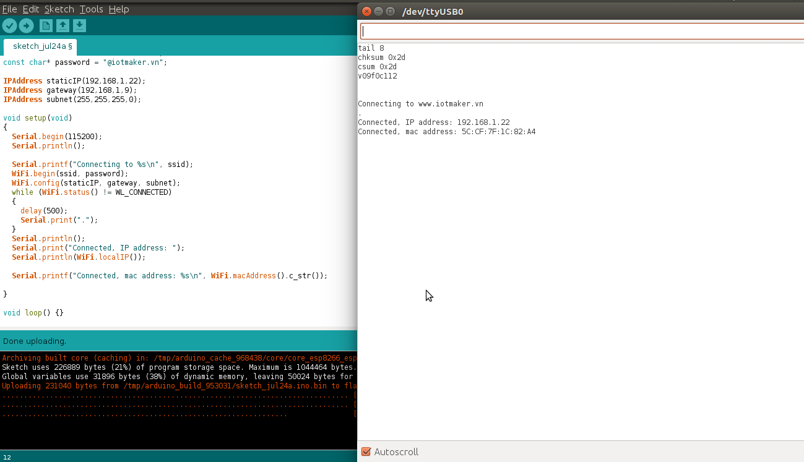


WiFi Station
------------
Khái niệm cơ bản
*****************

Thiết bị kết nối vào mạng WIFI được gọi là station (trạm). Việc kết nối vào mạng Wifi được hỗ trợ bởi một access point (AP), một AP có chức năng như một hub nhưng dùng cho nhiều station. Một access point thông thường được kết nối vào một mạng dây để phát WIFI (tức là chuyển từ mạng dây sang WIFI). Do đó access point luôn được tích hợp vào router. Mỗi access point được nhận biết bằng một SSID (Service Set IDentifier), SSID cũng là tên của mạng hiển thị khi ta kết nối vào WIFI.

Thư viện ESP8266WiFi.h có hỗ trợ các câu lệnh để module thưc hiện việc kết nối vào WIFI (làm chức năng của station).

Nội dung của lớp này được chia thành 4 phần:

* Thứ nhất, các phương pháp để kết nối đến một điểm truy cập
* Thứ hai, cung cấp các phương pháp để quản lý kết nối như ``reconnect`` hay ``isConnected``.
* Thứ ba, các hàm để lấy các thuộc tính về kết nối như MAC hay địa chỉ IP.
* Thứ tư, cung cấp các cách để kết nối như WPS hay Smart Config.

Mục lục
*******

* :ref:`Kết nối0` 

  * :ref:`begin0`
  * :ref:`config0`

* :ref:`Quản lý kết nối0` 

  * :ref:`reconnect0`
  * :ref:`disconnect0`
  * :ref:`isConnected0`
  * :ref:`setAutoConnect0`
  * :ref:`getAutoConnect0`
  * :ref:`setAutoReconnect0`
  * :ref:`waitForConnectResult0`

* :ref:`Cấu hình0` 

  * :ref:`macAddress0`
  * :ref:`localIP0`
  * :ref:`subnetMask0`
  * :ref:`gatewayIP0`
  * :ref:`dnsIP0`
  * :ref:`hostname0`
  * :ref:`status0`
  * :ref:`SSID0`
  * :ref:`psk0`
  * :ref:`BSSID0`
  * :ref:`RSSI0`

* :ref:`Kết nối khác0` 

  * :ref:`WPS0`
  * :ref:`Smart Config0`

.. _Kết nối0:

Kết nối 
==============

.. _begin0: 

begin
^^^^^

Để chuyển đối sang chế độ *station*, ta dùng hàm ``begin``. Các tham số cần thiết sẽ là *SSID* và *password*, để module có thể kết nối đến một Access Point (AP) cụ thể.

.. code:: cpp

   WiFi.begin(ssid, password)

Theo mặc định, ESP sẽ cố kết nối lại đến mạng WiFi sau khi bị *disconnect*. Do đó chúng ta không cần phải xử lý việc này trong code.

.. code:: cpp

   WiFi.begin()

Gọi hàm này module sẽ chuyển sang chế độ station và kết nối với điểm truy cập cuối cùng được sử dụng dựa trên cấu hình được lưu trong bộ nhớ flash.
Để thiết lập tất cả các thông số, ta có thể dùng lệnh:

.. code:: cpp

   WiFi.begin(ssid, password, channel, bssid, connect)

Các thông số:

* ``ssid``: tên WiFi của điểm truy cập mà chúng ta muốn kết nối đến, có thể có tối đa lên đến 32 ký tự.
* ``password``: mật khẩu của điểm truy cập, có độ dài từ 8 đến 64 ký tự.
* ``channel``: thiết lập kênh cho WiFi, tham số này có thể bỏ qua.
* ``bssid``: địa chỉ MAC của AP
* ``connect``: nếu giá trị là ``false``, module sẽ lưu các tham số nhưng không thiết lập kết nối đến điểm truy cập.

.. _config0:

config
^^^^^^

Lệnh này sẽ vô hiệu hóa DHCP và thiết lập cấu hình IP tĩnh cho *station*.

.. code:: cpp

   WiFi.config(local_ip, gateway, subnet, dns1, dns2)

Các đối số:

* ``local_ip``: IP tĩnh bạn muốn gán cho module
* ``gateway``: IP của gateway (thường là router) để kết nối ra mạng bên ngoài
* ``subnet``: subnet xác định phạm vi IP của mạng nội bộ
* ``dns1, dns2``: các tham số tùy chọn của máy chủ phân giải tên miền

.. code:: cpp

    #include <ESP8266WiFi.h>

    const char* ssid = "********";
    const char* password = "********";

    IPAddress staticIP(192,168,1,22);
    IPAddress gateway(192,168,1,9);
    IPAddress subnet(255,255,255,0);

    void setup(void)
    {
      Serial.begin(115200);
      Serial.println();

      Serial.printf("Connecting to %s \n", ssid);
      WiFi.begin(ssid, password);
      WiFi.config(staticIP, gateway, subnet);
      while (WiFi.status() != WL_CONNECTED)
      {
        delay(500);
        Serial.print(".");
      }
      Serial.println();
      Serial.print("Connected, IP address: ");
      Serial.println(WiFi.localIP());
    }

    void loop() {}

*output*

.. code:: cpp

    Connecting to gith-wifi
    .
    Connected, IP address: 192.168.1.22

Video DEMO
^^^^^^^^^^
.. youtube:: https://www.youtube.com/watch?v=OYP7lckCxRg
   

.. _Quản lý kết nối0:

Quản lý kết nối
================

.. _reconnect0:

reconnect
^^^^^^^^^

Điều này được thực hiện bằng cách ngắt kết nối sau đó thiết lập kết nối lại đến cùng một điểm truy cập.

.. code:: cpp

   WiFi.reconnect()

.. note::

    * Trạm phải được kết nối đến một điểm truy cập. Nếu không sẽ trả về ``false`` và không thực hiện bất kỳ hành động nào.
    * Nếu trả về ``true`` có nghĩa là kết nối đã được thiết lập lại, bạn vẫn phải kiểm tra trạng thái kết nối, chờ đợi cho kết khi báo cáo ``WL_CONNECTED``

CODE DEMO: 

.. code:: cpp

    WiFi.reconnect();
    while (WiFi.status() != WL_CONNECTED)
    {
      delay(500);
      Serial.print(".");
    }

.. _disconnect0:

disconnect
^^^^^^^^^^

Thiết lập cấu hình ``ssid`` và ``password`` thành ``null`` và thực hiện ngắt kết nối đến điểm truy cập.

.. code:: cpp

    WiFi.disconnect(wifioff)

* Đối số ``wifioff`` là tham số tùy chọn kiểu *boolean*, nếu là ``true`` thì chế độ trạm (station mode) sẽ bị tắt.

.. _isConnected0:

isConnected
^^^^^^^^^^^
Trả về ``true`` nếu Station kết nối với một điểm truy cập hoặc ``false`` nếu không.

.. code:: cpp

   WiFi.isConnected()

.. _setAutoConnect0:

setAutoConnect
^^^^^^^^^^^^^^

Định cấu hình module để tự động kết nối khi cấp nguồn đến điểm truy cập cuối cùng được sử dụng.

.. code:: cpp

   WiFi.setAutoConnect(autoConnect)

``autoConnect`` đây là tham số tùy chọn. Nếu đặt là ``false`` thì chức năng kết nối tự động sẽ bị tắt, nếu là ``true`` hoặc bỏ qua thì kết nối tự động sẽ được kích hoạt.

.. _getAutoConnect0:

getAutoConnect
^^^^^^^^^^^^^^

Đây là chức năng đi đôi với ``setAutoConnect()``. Nó trả về ``true`` nếu module được cấu hình để tự động kết nối với điểm truy cập được sử dụng lần cuối khi bật nguồn.

.. code:: cpp

   WiFi.getAutoConnect()

Trả về ``false`` nếu chức năng tự động kết nối bị vô hiệu.

.. _setAutoReconnect0:

setAutoReconnect
^^^^^^^^^^^^^^^^

Thiết đặt cho module tự động kết nối lại với một điểm truy cập trong trường hợp nó bị ngắt kết nối.

.. code:: cpp

   WiFi.setAutoReconnect(autoReconnect)

Nếu tham số ``autoReconnect`` được đặt thành ``true``, thì module sẽ cố gắng thiết lập lại kết nối bị mất với AP. Nếu thiết lập để ``false`` module sẽ không thực hiện kết nối lại.

.. note::

    Chạy ``setAutoReconnect(true)`` khi module đã bị ngắt kết nối sẽ không kết nối lại với điểm truy cập. Thay vào đó ``reconnect()`` nên sử dụng.

.. _waitForConnectResult0:

waitForConnectResult
^^^^^^^^^^^^^^^^^^^^

Chờ cho đến khi module kết nối với điểm truy cập. Chức năng này dành cho các module được cấu hình trong chế độ ``STA`` hoặc ``STA + AP``

.. code:: cpp

   WiFi.waitForConnectResult()

Chức năng trả về một trong các trạng thái kết nối sau đây:

* ``WL_CONNECTED`` - Sau khi kết nối thành công được thiết lập
* ``WL_NO_SSID_AVAIL`` - Trong trường hợp cấu hình SSID không thể đạt được
* ``WL_CONNECT_FAILED`` - Nếu mật khẩu không chính xác
* ``WL_IDLE_STATUS`` - Khi WiFi đang trong quá trình thay đổi giữa các trạng thái
* ``WL_DISCONNECTED`` - Nếu module không được cấu hình trong chế độ station

.. _Cấu hình0:

Cấu hình
==============

.. _macAddress0:

macAddress
^^^^^^^^^^

Lấy địa chỉ MAC của ESP station

.. code:: cpp 

   WiFi.macAddress(mac)

Với ``mac`` đó là một con trỏ đến vị trí bộ nhớ (một mảng uint8_t có 6 phần tử) để lưu địa chỉ mac. Cùng một giá trị con trỏ được trả về bởi chính hàm đó.

.. code:: cpp

    if (WiFi.status() == WL_CONNECTED)
    {
      uint8_t macAddr[6];
      WiFi.macAddress(macAddr);
      Serial.printf("Connected, mac address: %02x:%02x:%02x:%02x:%02x:%02x\n", macAddr[0], macAddr[1], macAddr[2], macAddr[3], macAddr[4], macAddr[5]);
    }

Nếu bạn không muốn sử dụng con trỏ, bạn có thẻ dùng lệnh dưới, nó trả về một định dạng ``String`` chứa địa chỉ mac:

.. code:: cpp 

   WiFi.macAddress()

.. code:: cpp

    if (WiFi.status() == WL_CONNECTED)
    {
      Serial.printf("Connected, mac address: %s\n", WiFi.macAddress().c_str());
    }

Kết quả thực hiện (địa chỉ MAC là duy nhất cho mỗi thiết bị truy cập vào mạng):

.. _localIP0:  

localIP
^^^^^^^

Chức năng dùng để lấy địa chỉ IP của ESP station

.. code:: cpp

   WiFi.localIP()

Kiểu trả về là đại chỉ IP của module ESP8266.

.. code:: cpp

    if (WiFi.status() == WL_CONNECTED)
    {
      Serial.print("Connected, IP address: ");
      Serial.println(WiFi.localIP());
    }

*output:*

.. code:: cpp

    Connected, IP address: 192.168.1.10

.. _subnetMask0:  

subnetMask
^^^^^^^^^^

Trả về subnet mask của ESP station

.. code:: cpp

   WiFi.subnetMask()

Module nên được kết nối với điểm truy cập. Nếu không sẽ trả về 0.0.0.0

.. code:: cpp

    Serial.print("Subnet mask: ");
    Serial.println(WiFi.subnetMask());

*output:*

.. code:: cpp

    Subnet mask: 255.255.255.0

.. _gatewayIP0:  

gatewayIP
^^^^^^^^^

Lấy địa chỉ IP của gateway

.. code:: cpp

   WiFi.gatewayIP()

.. code:: cpp

    Serial.printf("Gataway IP: %s\n", WiFi.gatewayIP().toString().c_str());

*output:*

.. code:: cpp

    Gateway IP: 192.168.1.9

.. _dnsIP0:  

dnsIP
^^^^^

Lấy địa chỉ IP của Máy chủ Tên miền (DNS).

.. code:: cpp

   WiFi.dnsIP(dns_no)

Với tham số đầu vào ``dns_no`` chúng ta có thể chỉ định địa chỉ IP của DNS mà chúng ta cần. Nếu không có tham số nào được cung cấp, thì IP của DNS #1 sẽ được trả về.

.. code:: cpp

    Serial.print("DNS #1, #2 IP: ");
    WiFi.dnsIP().printTo(Serial);
    Serial.print(", ");
    WiFi.dnsIP(1).printTo(Serial);
    Serial.println();

*output:*

.. code:: cpp

    DNS #1, #2 IP: 62.179.1.60, 62.179.1.61

.. _hostname0:  

hostname
^^^^^^^^

Lấy DHCP hostname được gán cho ESP station.

.. code:: cpp

   WiFi.hostname()

Trả về kiểu ``String``. Tên máy chủ mặc định ở định dạng **ESP_24xMAC** với 24xMAC là 24 bit cuối cùng của địa chỉ MAC của module.

Tên máy chủ có thể được thay đổi bằng cách sử dụng chức năng sau:

.. code:: cpp

   WiFi.hostname(aHostname)

Tham số đầu vào ``aHostname`` có thể là một kiểu ``char*``, ``const char*`` hoặc ``String``. Chiều dài tối đa của tên máy chủ được chỉ định là 32 ký tự. Chức năng trả về ``true`` hoặc ``false`` phụ thuộc vào kết quả.

Ví dụ, nếu giới hạn 32 ký tự vượt quá, chức năng sẽ trả lại ``false`` mà không gán tên máy chủ mới.

.. code:: cpp

    Serial.printf("Default hostname: %s\n", WiFi.hostname().c_str());
    WiFi.hostname("Station_Tester_02");
    Serial.printf("New hostname: %s\n", WiFi.hostname().c_str());

*output:*

.. code:: cpp

    Default hostname: ESP_081117
    New hostname: Station_Tester_02

.. _status0:  

status
^^^^^^

Trả về trạng thái kết nối Wi-Fi.

.. code:: cpp 

   WiFi.status()

Chức năng trả về một trong các trạng thái kết nối sau đây:

* ``WL_CONNECTED`` - Sau khi kết nối thành công được thiết lập
* ``WL_NO_SSID_AVAIL`` - Trong trường hợp cấu hình SSID không thể đạt được
* ``WL_CONNECT_FAILED`` - Nếu mật khẩu không chính xác
* ``WL_IDLE_STATUS`` - Khi Wi-Fi đang trong quá trình thay đổi giữa các trạng thái
* ``WL_DISCONNECTED`` - Nếu module không được cấu hình trong chế độ trạm

Giá trị trả lại kiểu ``wl_status_t`` được định nghĩa trong *wl_definitions.h*

CODE DEMO

.. code:: cpp

    #include <ESP8266WiFi.h>

    void setup(void)
    {
        Serial.begin(115200);
        Serial.printf("Connection status: %d\n", WiFi.status());
        Serial.printf("Connecting to %s\n", ssid);
        WiFi.begin(ssid, password);
        Serial.printf("Connection status: %d\n", WiFi.status());
        while (WiFi.status() != WL_CONNECTED)
        {
        delay(500);
        Serial.print(".");
        }
        Serial.printf("\nConnection status: %d\n", WiFi.status());
        Serial.print("Connected, IP address: ");
        Serial.println(WiFi.localIP());
    }

    void loop() {}

*output:*

.. code:: cpp

    Connection status: 6
    Connecting to sensor-net
    Connection status: 6
    ......
    Connection status: 3
    Connected, IP address: 192.168.1.10

Các trạng thái kết nối đặc biệt 6 và 3 có thể được xem xét trong *wl_definitions.h* như sau:

.. code:: cpp

    3 - WL_CONNECTED
    6 - WL_DISCONNECTED

Dựa trên ví dụ này, khi chạy trên mã, mô-đun ban đầu bị ngắt kết nối khỏi mạng và trả về trạng thái kết nối 6 - ``WL_DISCONNECTED``. Nó cũng bị ngắt kết nối ngay sau khi chạy ``WiFi.begin(ssid, password)``. Sau đó, sau khoảng 3 giây (dựa trên số dấu chấm được hiển thị mỗi 500ms), cuối cùng nó sẽ được kết nối trở lại trạng thái 3 - ``WL_CONNECTED``.

.. _SSID0:  

SSID
^^^^

Trả lại tên của mạng Wi-Fi đã kết nối.

.. code:: cpp

   WiFi.SSID()

Kiểu trả về ``String``

.. code:: cpp

    Serial.printf("SSID: %s\n", WiFi.SSID().c_str());

*output:*

.. code:: cpp

    SSID: sensor-net

.. _psk0:  

psk
^^^

Trả lại mật khẩu hiện tại được liên kết với mạng Wi-Fi.

.. code:: cpp 

   WiFi.psk()

Kiểu trả về ``String``

DEMO:

Mô tả: Với module ESP8266 đã kết nối wifi ở trên,ta cần hiển thị password wifi đã kết nối

Code:

.. code:: cpp

    #include <ESP8266WiFi.h>

    void setup()
    {
      Serial.begin(115200);
      Serial.println();

 
      Serial.printf("pass: %s ", WiFi.psk().c_str() );
    }
    void loop() {}

Output:

.. code:: cpp

    pass: @iotmaker.vn

.. _BSSID0:  

BSSID
^^^^^

Trả lại địa chỉ mac điểm truy cập mà ESP kết nối đến.

.. code:: cpp 

   WiFi.BSSID()

Trả về một con trỏ đến vị trí nhớ (một mảng ``uint8_t`` với có kích thước là 6), nơi *BSSID* được lưu.

Hàm dưới đây có chức năng tương tự, nhưng trả lại *BSSID* là một kiểu ``String``.

.. code:: cpp

   WiFi.BSSIDstr()

.. code:: cpp

    Serial.printf("BSSID: %s\n", WiFi.BSSIDstr().c_str());

*output:*

.. code:: cpp

    BSSID: 00:1A:70:DE:C1:68

.. _RSSI0:  

RSSI
^^^^

Trả lại cường độ tín hiệu của mạng Wi-Fi.

.. code:: cpp
    WiFi.RSSI()

Giá trị cường độ tín hiệu được cung cấp trong **dBm**. Kiểu trả về giá trị là ``int32_t``.

.. code:: cpp

    Serial.printf("RSSI: %d dBm\n", WiFi.RSSI());

*output:*

.. code:: cpp

    RSSI: -68 dBm

.. _Kết nối khác0:  

Kết nối khác
==============

ESP8266 SDK cung cấp các phương pháp thay thế để kết nối trạm ESP với một điểm truy cập. Core esp8266 / Arduino  thực hiện WPS và Smart Config như mô tả dưới đây.

.. _WPS0:  

WPS
^^^

Chức năng ``beginWPSConfig`` sau đây cho phép kết nối với mạng sử dụng WPS (Wi-Fi Protected Setup). Hiện tại chỉ hỗ trợ cấu hình nút nhấn (chế độ WPS_TYPE_PBC) (SDK 1.5.4).

.. code:: cpp

   WiFi.beginWPSConfig()

Tùy thuộc vào kết quả kết nối chức năng trả về ``true`` hoặc ``false``.

.. code:: cpp

    #include <ESP8266WiFi.h>

    void setup(void)
    {
      Serial.begin(115200);
      Serial.println();

      Serial.printf("Wi-Fi mode set to WIFI_STA %s\n", WiFi.mode(WIFI_STA) ? "" : "Failed!");
      Serial.print("Begin WPS (press WPS button on your router) ... ");
      Serial.println(WiFi.beginWPSConfig() ? "Success" : "Failed");

      while (WiFi.status() != WL_CONNECTED)
      {
        delay(500);
        Serial.print(".");
      }
      Serial.println();
      Serial.print("Connected, IP address: ");
      Serial.println(WiFi.localIP());
    }

    void loop() {}

*output:*

.. code:: cpp

    Wi-Fi mode set to WIFI_STA
    Begin WPS (press WPS button on your router) ... Success
    .........
    Connected, IP address: 192.168.1.102

.. _Smart Config0:

Smart Config
^^^^^^^^^^^^

Để bắt đầu thiết lập cấu hình bằng chức năng này, dùng lệnh sau:

.. code:: cpp

   beginSmartConfig()

Kiểm tra trạng thái để quyết định khi ngừng cấu hình. Chức năng trả về ``true`` hoặc ``false``

.. code:: cpp

   smartConfigDone()

Dừng cấu hình thông minh, giải phóng bộ đệm ``beginSmartConfig()``. Tùy thuộc vào chức năng kết quả trả về ``true`` hoặc ``false``.

.. code:: cpp 
   stopSmartConfig()

Để biết thêm chi tiết về Smart Config, vui lòng tham khảo `tại đây <../wifi/smartconfig.html>`_.
